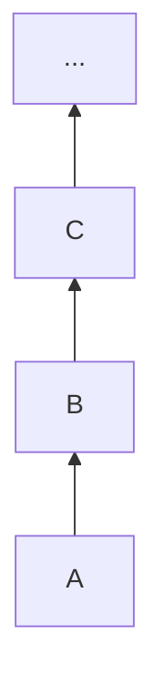

# organize
Lecture content goes here.

## with subsections

# Expected progress

after


```mermaid
graph BT;
    A-->B;
    B-->C;
    C-->...;
```

```python
print("im a block of code")
```

### and subsubsections