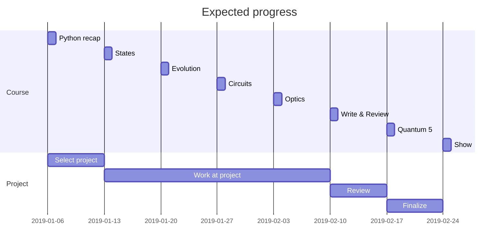

## How to advance through the course
This is a 7 weeks long (8 lectures), project-based course. At the end of the course the projects will be published on the website of the course (it's not the one your are in). Each week we will have two consecutive 90 minutes lectures (hopefully this will improve in the future).

You will be evaluated on your effort, on the quality of your project and on the feedback that you will give to other projects. You will work individually or in groups toward a project in the form of a jupyter notebook. The topic of the project will be chosen by you, after an initial week of selection (skimming papers). It can fall under the categories of visualizations, simulations or lectures.

At the end of **week 5** you must submit the candidate final project (not just a draft, but something you would actually publish online). At the beginning of **week 6** you will be assigned two (anonymized) projects that you have to __review and resubmit__ by the end of the week. The reviews will be evaluated and they will contribute your final score. You will be given instructions on how to review.

On **week 7**, you will receive the reviews back, and you will have until the end of the week to submit the final version. The final versions will be presented during the final lecture, and they will be published on the course's website.

## Code of Ethics

### Academic Integrity
Although we are happy for you to collaborate when working on the project, you will take responsibility for your own work, and we take plagiarism very seriously.
### Late policy
Please respect other people’s time: missing a deadline is an automatic 10% mark reduction.
### Discrimination policy
Any indication of discrimination on the basis of race, colour, religion, sex, sexual orientation, gender identity, age, national origin, ancestry, disability or physical appearance will not be tolerated and should be brought to the instructor’s attention immediately.