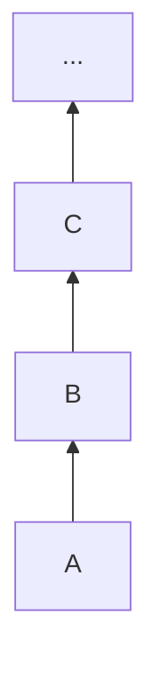
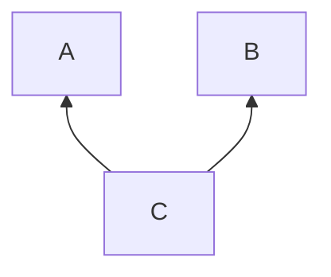
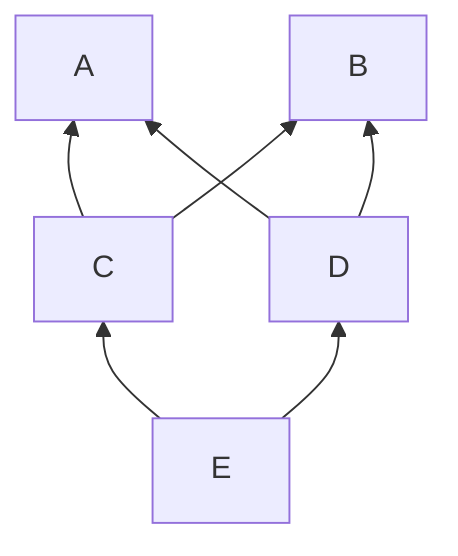
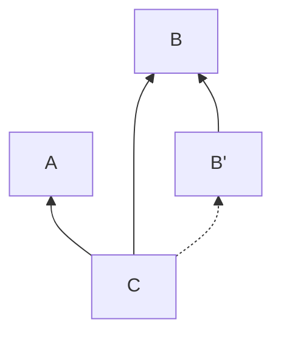
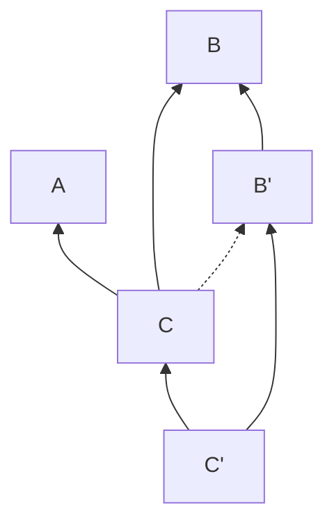

## The MRO
The MRO (Method Resolution Order) is the order in which Python arranges the chain of `super()` calls in the context of inheritance (code reuse[^3]) among Python classes. Its algorithm (called C3) decides what is the sequence of classes in the namespace to follow when searching for a method. 

### Linear inheritance
In case of each class having only a single superclass and no two classes sharing the same parent, the MRO is linear:



In this case, the order in which Python will look for methods called from `A` is to first look in `A`, then look in `B`, then in `C` and so on. At each step `super()` was called to look in the superclass. We then say that the Method Resolution Order of `A` (i.e. the order in which a method is resolved) is `A B C ...`. 

We also see that the MRO of `B` is `B C ...` and as linear inheritance is much more frequently used than multiple inheritance (especially when one first learns the language) we grow accustomed to understand `super()` as referring to the superclass. 

However, things are not so, and it can be extremely puzzling to find out while experimenting with multiple inheritance. This post tries to explain why things are the way they are and especially why such design choice not only makes sense, but it is a brilliant choice.

### Multiple inheritance

> `super` should not be called 'super', it should be called 'next_in_line'
>
> -- Raymond Hettinger

Why would Ray think that? Imagine a simple scenario of a class `C` inheriting from `A` and `B`:

```python
class A: pass
class B: pass
class C(A, B): pass
```



If we call a method from `C`, where will Python search for it? It would first look in `C`, then look into `A` and then `B`. You may think that `super()` is just calling the parents of `C`.

But when you think about it, this means that if we initiate a `super()` call from `C`, a `super()` call from `A` would not call `object`, it would call `B`. And `B` is not a parent of `A`. On the other hand, if we initiate a `super()` call from `A`, it would call `object`.

So we have learned our first lesson:

**Lesson 1:** The fact that the MRO of `C` is `C A B` does not imply that the MRO of `A` is `A B`. `super()` does not always call the parents, nor always the same class.
{:.success}

That is what Ray meant: `super()` just goes through the sequence that is spelled out in the MRO, and the MRO depends on who initiated the call.

This is weird. Does it get weirder? Let's take a look at the following diagram[^1] to understand how we can take advantage of the behaviour of `super()`:

[^1]: The order of the arguments here matters, e.g. if D were to inherit first from `B` and then from `A`, Python would raise a `TypeError` because it cannot create a consistent MRO.

```python
class A: pass
class B: pass
class C(A, B): pass
class D(A, B): pass  # D(B, A) raises a TypeError, as the MRO is inconsistent
class E(C, D): pass
```



What is the MRO of `C`? It's the same as before: `C A B`, the fact that we have added new structure does not affect it. This means that a call to `super()` initiated in `C` will call `A` and that a subsequent call of `super()` from `A` will call `B`.


**Lesson 2:** The MRO of a class is deterministic: subclasses of the class or its parents will not affect it.
{:.success}

On the other hand, the MRO of `E` is `E C D A B`, so now `C` is followed by `D` instead of `A`. Now a call to `super()` initiated from `E`, after reaching `C` it would call `D`, not `A`! 
This can be understood if we remember that `super()` does not call the parents, it calls the children's parents[^2].

[^2]: In Python 3, the machinery behind `super` takes care of handling the details for us and we don't need to specify anymore (as in Python 2) who was the initiating class and where we are in the chain.

So we can draw an important lesson about `super` that we should always keep in mind:

**Lesson 3:** Children are called first.
{:.success}

That is why `A` is followed by `D`, because after `A` we look at its children who are `C` and `D`. We have already called `C`, and `D` is nobody's parent, so now it's the turn of `D`.

Did Guido lose his mind? Or is this one of his many strokes of genius? It turns out that this behaviour of `super()` allows us to do many cool things, one of which is dependency injection.

## Dependency Injection

Suppose that a certain method that we need in `C` is located in `B`, and therefore we subclassed `B` when writing `C`. But we are not very happy with the way this method works and we would like to use a variation of it (perhaps we have an improved version, or we would like to test another version). We could modify the code in `B`, but there might be resons why we cannot or don't want to do it (perhaps we don't have access to the code, or we don't want to break other stuff). It would be great to simply _retarget_ `C` and avoid having to copy a lot of the code into a second class `C'` that calls `B'`[^4] :

[^3]: >Inheritance is a tool for code reuse. -- Raymond Hettinger
[^4]: DRY = Don't Repeat Yourself



**Question**: how can we tell `C` to search for the method in `B'` before searching for it in  `B`?  
**Answer**: we use dependency injection.

Here's the magic of calling the children's parents instead of the parents: we just write an _empty_ subclass `C'` which subclasses `C` and `B'` like so:

```python
class B_prime(B): pass  # override B's method in here
class C_prime(C, B_prime): pass  # leave empty
```



The exact reasoning in the C3 algorithm when we initiate a method call from `C` is the following (pay attention to the fact that children are always prioritised and after you have gone through this example, see you can figure out why the MRO of `E` in the example above is `E C D A B`):
1. The parents of `C'` are `C` and `B'`. Is `C` somebody's else's parent? No, so let's go to `C`.
2. The parents of `C` are `A` and `B`. Is `A` somebody's else's parent? No, so let's go to `A`.
3. `A` has no parents, so the next should be other parent of `C`, i.e. `B`, but is `B` somebody's else's parent? Yes it's the parent of `B'`!
4. And is `B'` somebody's else's parent? Yes it's the parent of `C'`!
5. And is `C'` somebody's else's parent? No, and we have already looked into its parent `C`, so let's go to the other parent `B'`.

So the MRO of `C'` is `C' C A B' B`, and we will intercept the call to the method with the new version in `B'`. Voila.


And what's best, we have achieved all this __with an empty class__[^5]! If this is not genius I don't know what it is.

[^5]: What if along the way we find a class who specifically inherits from another class, without relying on `super()`? You should know the answer to this question: you just subclass it, replace the method with a call to `super()` and you inject this dependency.